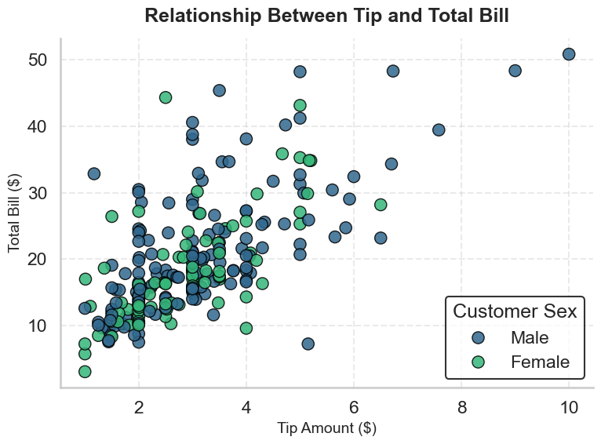
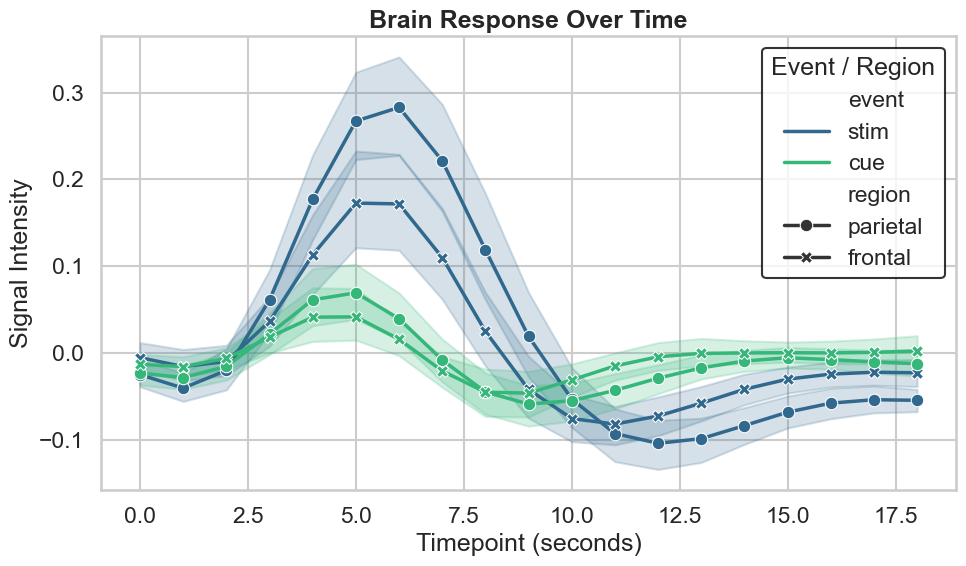
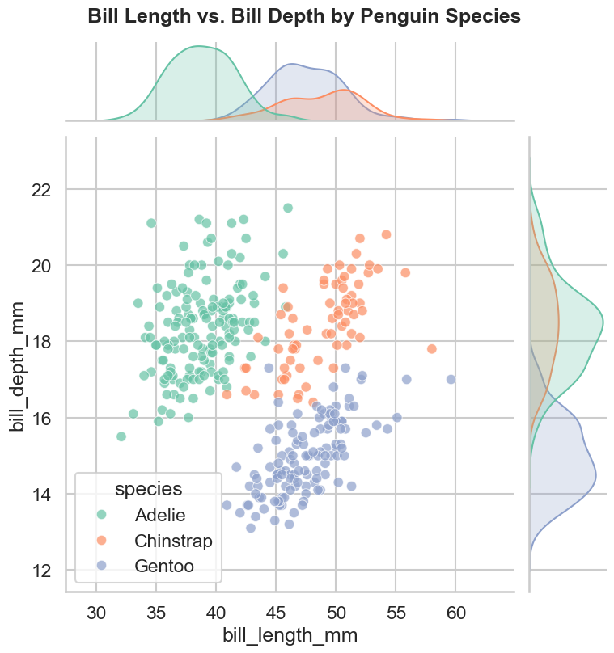
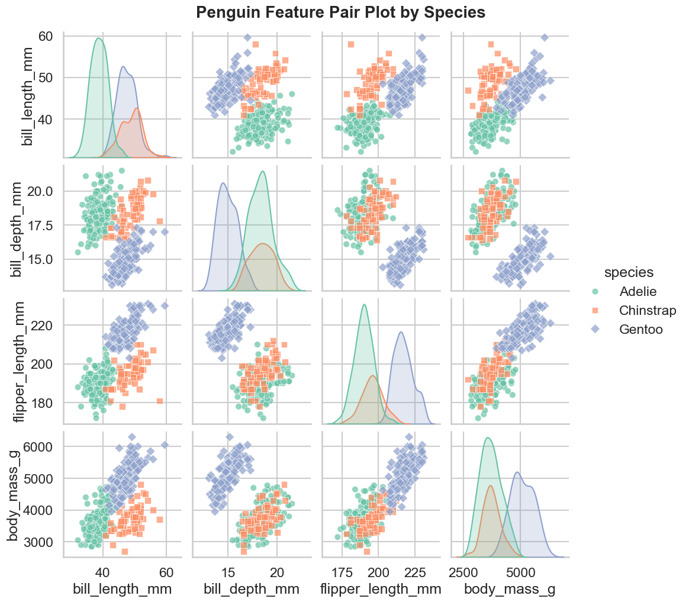

# SmartGraph-Builder

<div align="center">

**A powerful PyQt6-based data visualization assistant for automated graph creation and Seaborn code generation**

[](https://www.python.org/downloads/)
[](https://www.riverbankcomputing.com/software/pyqt/)
[](LICENSE)

[Features](#features) • [Installation](#installation) • [Usage](#usage) • [Sample Graphs](#sample-visualizations) • [Documentation](#project-structure) • [Contributing](#contributing)

</div>

---

## Overview

SmartGraph-Builder is a professional data visualization tool designed to streamline the creation of publication-quality graphs. Built with PyQt6, it combines an intuitive graphical interface with powerful analysis capabilities, enabling users to generate appropriate visualizations for their datasets and export production-ready Seaborn code.

### Key Capabilities

- 📊 **Intelligent Visualization** - Smart analysis recommends optimal graph types based on your data characteristics
- 🎨 **Customizable Graphs** - Fine-tune every aspect of your visualizations with an intuitive parameter interface
- 💾 **Code Export** - Generate clean, reusable Seaborn code ready for your Python projects
- 🔧 **Data Preprocessing** - Built-in tools for cleaning, transforming, and preparing datasets
- 🖥️ **Modern GUI** - Professional PyQt6 interface designed for efficiency and ease of use

---

## Features

### Data Management
- Import data from CSV, Excel, and other common formats
- Automated data type detection and validation
- Missing value handling and data cleaning utilities
- Dataset preview and summary statistics

### Visualization Engine
- Support for multiple graph types:
  - Scatter plots
  - Line charts
  - Bar charts
  - Histograms
  - Box plots
  - Heatmaps
  - And more...
- Real-time preview of visualizations
- Interactive parameter adjustment
- Professional styling options

### Code Generation
- Export production-ready Seaborn code
- Clean, documented, and reproducible code
- Customizable templates
- Copy-paste ready for immediate use

---

## Installation

### Prerequisites

- Python 3.8 or higher
- pip package manager

### Setup

1. **Clone the repository**
   ```bash
   git clone https://github.com/VinnyT456/SmartGraph-Builder.git
   cd SmartGraph-Builder
   ```

2. **Install dependencies**
   ```bash
   pip install -r requirements.txt
   ```

3. **Launch the application**
   ```bash
   python main.py
   ```

### Required Dependencies

```
PyQt6>=6.0.0
pandas>=1.3.0
matplotlib>=3.4.0
seaborn>=0.11.0
numpy>=1.21.0
```

---

## Usage

### Quick Start

1. **Launch Application**
   ```bash
   python main.py
   ```

2. **Load Your Data**
   - Click "Load Dataset" to import your CSV or Excel file
   - Review the data preview and summary statistics

3. **Select Visualization Type**
   - Browse recommended graph types
   - Choose the visualization that best suits your data

4. **Customize Parameters**
   - Adjust colors, labels, titles, and styling
   - Configure axes and scales
   - Set legends and annotations

5. **Generate & Export**
   - Preview your visualization
   - Export the graph as an image
   - Copy the generated Seaborn code

### Example Workflow

```python
# Example of generated code from SmartGraph-Builder

import pandas as pd
import seaborn as sns
import matplotlib.pyplot as plt

# Load dataset
df = pd.read_csv('dataset.csv')

# Create visualization
plt.figure(figsize=(10, 6))
sns.scatterplot(
    data=df,
    x='feature_1',
    y='feature_2',
    hue='category',
    palette='viridis',
    s=100
)

plt.title('Feature Comparison by Category', fontsize=16, fontweight='bold')
plt.xlabel('Feature 1', fontsize=12)
plt.ylabel('Feature 2', fontsize=12)
plt.legend(title='Category', bbox_to_anchor=(1.05, 1), loc='upper left')
plt.show()
```

---

## Project Structure

```
SmartGraph-Builder/
├── main.py                    # Application entry point and main window
├── requirements.txt           # Python package dependencies
├── LICENSE                    # MIT License
├── sections/                  # Core application modules
│   ├── ai_summary.py         # Data analysis and visualization recommendations
│   ├── buttons.py            # UI button components and event handlers
│   ├── code_generation.py    # Seaborn code generation engine
│   ├── data_preprocessing.py # Data cleaning and transformation utilities
│   ├── dataset.py            # Dataset loading and management
│   ├── graph.py              # Core graph generation logic
│   ├── graph_parameter.py    # Graph customization and parameter controls
│   └── plot_manager.py       # Plot rendering and display management
└── sample_graphs/             # Example visualizations and output samples
```

### Module Descriptions

| Module | Purpose |
|--------|---------|
| `main.py` | Initializes the PyQt6 application and coordinates all components |
| `ai_summary.py` | Analyzes dataset characteristics and recommends optimal visualizations |
| `data_preprocessing.py` | Handles data cleaning, normalization, and preprocessing operations |
| `dataset.py` | Manages dataset import, validation, and storage |
| `graph.py` | Core visualization engine using Matplotlib and Seaborn |
| `graph_parameter.py` | User interface for customizing graph properties and styling |
| `code_generation.py` | Generates clean, exportable Seaborn code from user configurations |
| `plot_manager.py` | Manages plot rendering, updates, and display in the GUI |
| `buttons.py` | Implements GUI controls and user interaction handlers |

---

## Sample Visualizations

Explore examples of visualizations created with SmartGraph-Builder, demonstrating various graph types and styling options.

<div align="center">

### Scatter Plot


### Line Plot


### Joint Plot


### Pairplot



</div>

*More examples available in the `sample_graphs/` directory*

---

## Contributing

Contributions are welcome! Feel free to submit a Pull Request or open an issue for bug reports and feature requests.

---

## License

This project is licensed under the MIT License - see the [LICENSE](LICENSE) file for full details.

```
MIT License - Copyright (c) 2024
Permission is hereby granted, free of charge, to any person obtaining a copy
of this software and associated documentation files...
```

---

## Acknowledgments

SmartGraph-Builder is built with powerful open-source technologies:

- **[PyQt6](https://www.riverbankcomputing.com/software/pyqt/)** - Professional cross-platform GUI framework
- **[Seaborn](https://seaborn.pydata.org/)** - Statistical data visualization library
- **[Matplotlib](https://matplotlib.org/)** - Comprehensive plotting library
- **[Pandas](https://pandas.pydata.org/)** - Data manipulation and analysis
- **[NumPy](https://numpy.org/)** - Numerical computing foundation

---

## Support & Contact

**Repository**: [github.com/VinnyT456/SmartGraph-Builder](https://github.com/VinnyT456/SmartGraph-Builder)

**Issues**: Found a bug or have a feature request? [Open an issue](https://github.com/VinnyT456/SmartGraph-Builder/issues)

**Discussions**: Have questions or ideas? Start a [discussion](https://github.com/VinnyT456/SmartGraph-Builder/discussions)

---

<div align="center">

**Built for streamlined data visualization and analysis**

⭐ Star this repository if you find it helpful!

</div>
