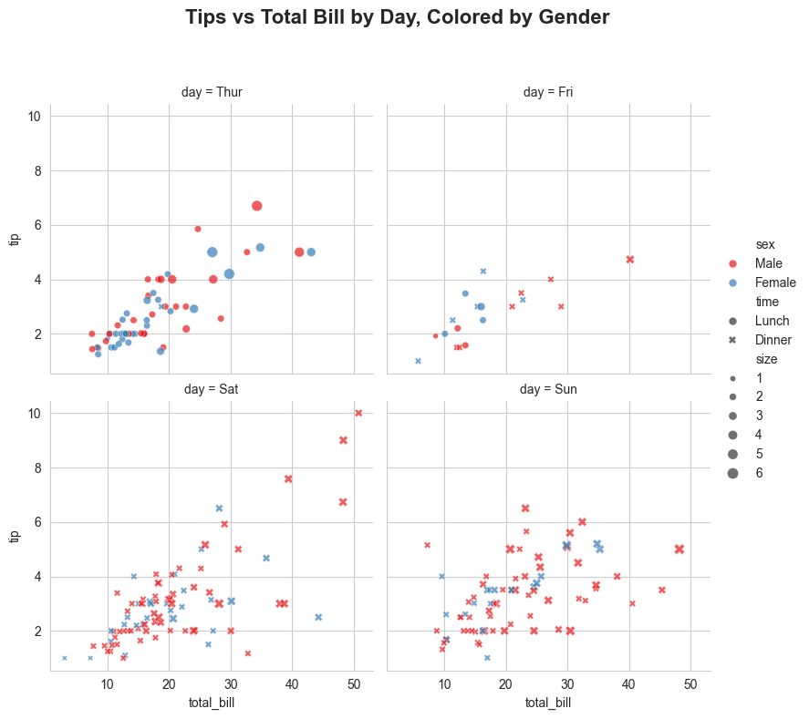

# SmartGraph Builder

PyQt6 desktop app for exploring a CSV dataset, previewing a plot (currently **Scatter Plot** end-to-end), and generating reproducible Seaborn/Matplotlib code from the same UI configuration.

[](https://www.python.org/downloads/)
[](https://www.riverbankcomputing.com/software/pyqt/)
[](LICENSE)

[Features](#features-current) • [Install](#installation) • [Run](#run) • [Roadmap](#roadmap-near-term) • [Contributing](#contributing)

## Project status

- **Implemented today**: Scatter Plot live preview + code generation, plus shared styling controls (titles, legend, grid).
- **In progress / roadmap**: Other plot types appear in the catalog UI, but runtime rendering and code generation are not yet wired for them.

The catalog of intended plot types lives in [`sections/graph_parameter.py`](sections/graph_parameter.py) (`SEABORN_PLOTS`), while the runtime rendering and codegen dispatch are currently Scatter-only ([`sections/graph.py`](sections/graph.py), [`sections/code_generation.py`](sections/code_generation.py)).

## Features (current)

- **CSV dataset loading and preview**: Load a CSV, inspect columns, and feed the selected dataset into plotting.
- **Scatter Plot preview**: Configure x/y and common aesthetics (e.g. hue/palette/marker/alpha) and see the plot update.
- **Code generation**: Produce Seaborn + Matplotlib code for the current plot configuration and copy/export it.
- **Styling helpers**: Title, axis titles, legend, and grid controls.

Notes:

- **CSV only** at the moment (no Excel import yet).
- The **AI Summary** and **Data Preprocessing** panels are present as UI sections, but their “assistant” logic is not yet implemented.

## Installation

This repo is tested in CI with **Python 3.12** on Linux ([`.github/workflows/main.yml`](.github/workflows/main.yml)).

From the repository root (recommended; the folder name contains a space: `SmartGraph Builder/`):

```bash
python -m pip install -r requirements.txt
```

Developer dependencies (tests):

```bash
python -m pip install -r requirements-dev.txt
```

## Run

Run from the **repository root** so relative paths resolve (e.g. `styles.qss`, runtime config files):

```bash
python main.py
```

On startup, `main.py` clears files under `dataset/`. If you keep anything important there, move it elsewhere first.

## Usage (Scatter Plot path)

1. Launch: `python main.py`.
2. Load a CSV dataset.
3. Select **Scatter Plot**.
4. Pick x/y columns and adjust parameters.
5. Use **Code Preview** / **Copy Code** to export the generated Seaborn/Matplotlib code.

## Roadmap (near-term)

The most important next steps are to make the catalog, runtime rendering, and code generation use the same canonical plot keys, so more plot types can be implemented incrementally.

- **Unify dispatch for multiple plot types**: Extend runtime rendering and codegen beyond Scatter.

- **Make plot type + parameter definitions a single source of truth**: Extract `SEABORN_PLOTS` into a catalog module and introduce a registry for parameter dialogs.

- **Split the UI monolith**: Break up `sections/buttons.py` into a package so adding new plot families is low-conflict.

- **Stabilize persistence/config lifecycle**: Remove risky config side effects and align DB keys with the catalog.

- **Product polish**: Restore/generate missing `sample_graphs/` thumbnails referenced by the plot catalog; add clearer user-facing docs inside the UI; consider Excel import once CSV flow is solid.

## Repository layout

This project is moving toward a more modular structure as more plot types are implemented.

### Current (today)

```text
SmartGraph Builder/
  main.py
  styles.qss
  requirements.txt
  requirements-dev.txt

  sections/
    ai_summary.py
    buttons.py
    code_generation.py
    data_preprocessing.py
    dataset.py
    graph.py
    graph_parameter.py
    plot_manager.py

  dataset/
  sample_graphs/
```

### Target (planned)

```text
SmartGraph Builder/
  main.py
  requirements.txt
  styles.qss

  assets/
    sample_graphs/
    icons/

  dataset/
    user_dataset.csv

  sections/
    __init__.py

    catalog/
      __init__.py
      plots.py
      parameter_ids.py
      registry.py

    config/
      plot_defaults.py

    plot_manager.py

    buttons/
      __init__.py
      axis.py
      titles.py
      shared/
      legend/
      grid/
      aesthetics.py
      specific/
        lineplot.py
        regression.py
        distribution.py
        categorical.py
        matrix.py
        relational.py

    graph_parameter.py
    graph.py
    code_generation.py
    dataset.py
    data_preprocessing.py
    ai_summary.py

  tests/
    test_app.py
    test_catalog.py
    test_registry.py
```

## Screenshots

The plot catalog expects thumbnails under `sample_graphs/` (configured in `SEABORN_PLOTS`). Only a single thumbnail is currently present in the repo:

<div align="center">
  
</div>

## License

This project is licensed under the MIT License. See [`LICENSE`](LICENSE).
